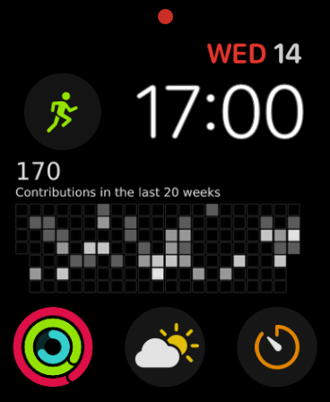
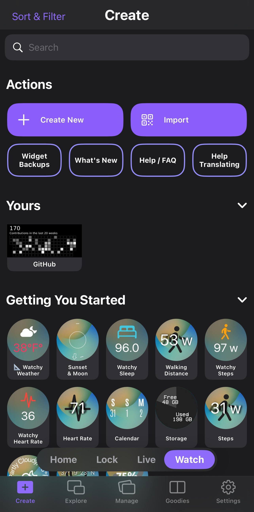

# Using with Apple Watch

The Widgy app used in [the iOS tutorial](/docs/using-with-ios/widgy-widgets-app) also supports
creating widgets on the apple watch.

In the following screenshot the rectangular widget showing the GitHub commit graph is a Widgy
widget connected to Slipway:

To create this, you simply follow the same instructions in [the iOS tutorial](/docs/using-with-ios/widgy-widgets-app),
but first select "Watch" on the bar at the bottom of the Create page, and then
when you click "Create New" select the type of Apple Watch widget you want to create.

