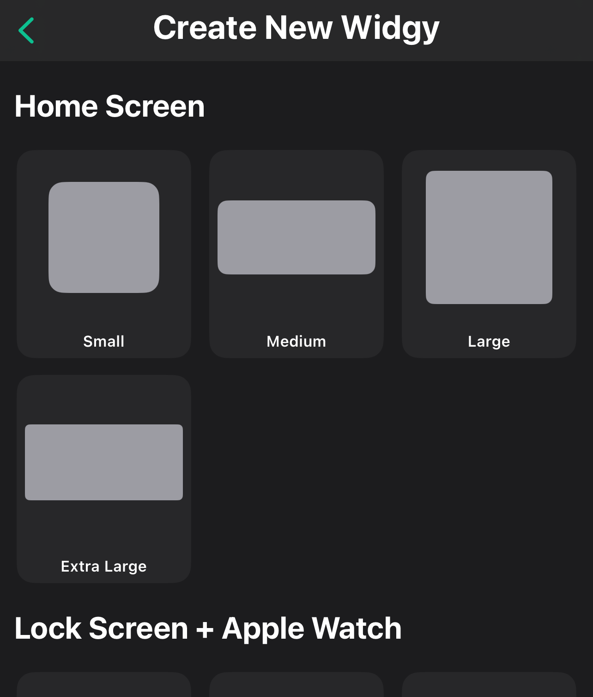

# Widgy Widgets App

The [Widgy Widgets app](https://apps.apple.com/gb/app/widgy-widgets-home-lock-watch/id1524540481) is a free 
app that lets you create custom Widgets in iOS.

This is the first app I tried with Slipway, and it seems to work well, although the UI is fairly complicated.


## Creating a Slipway Rig Widget

Open the app and you should be presented with the "Create" page. Click on "Create New":


Next select a size for your widget. I'll select "Medium" for this tutorial:



The app will then prompt you for a widget name an author. Enter whatever you like here.
I accepted the default name of "Mouhoun", but you would probably name if after what you plan on displaying.

Next you're presented with a preview of your widget at the top of the screen,
and the configuration controls at the bottom.


Click on "Add New Layer" and select "Image" from the list of options, then use the Size controls
to make the image as large as the widget:


Now we need to point the image layer at the Rig on our Slipway server.

Click on the small "image" icon next to the "Frame" button:


From the list of image sources on the left, select "Web and Maps",
then from the list that appears on the right select "Web URL (No Caching)".


You will be prompted to enter a URL.
Enter the URL of the Rig, Playlist or Device you want to display, including setting the authorization query string
parameter to one of the configured API keys for your Slipway server.

For example, if your Slipway server is hosted on Fly.io at the domain `https://slipway-asdf-test.fly.dev/`, and
your wanted to display a Rig called `foo`, you might enter a URL such as:

```
https://slipway-asdf-test.fly.dev/rigs/foo?authorization=<YOUR_API_KEY>
```

Where `<YOUR_API_KEY>` should be replaced with your actual API key.

Widgy will display "Fetching Data" and then your Rig should appear in the preview.


Now you can click the "Back" button (`<`) in the very top left of the screen, and click "Confirm",
and you should see your Widget displayed
in the "Yours" section of the "Create" page.

In my case I've created the widget twice, so it appears twice:


Now you can exit the Widgy app and return to your iOS home screen.

# Adding the Slipway Widget to your iOS Home Screen

On your iOS home screen, on the page you want to add the widget, long press in some empty space
until the icons start to jiggle, then click "Edit" in the top left, and then "Add Widget".

Search for "Widgy" on the page that appears, and select the "Widgy" app.

Scroll through the available widgets until you see the one you just created:


Click the "Add Widget" button at the bottom of the screen, and your Slipway Rig should now appear
on your iOS home screen.


## Refreshing

There isn't a lot of control over the refreshing of the widgets on the iOS home screen, as far as I know.

The behavior I've observed is that when you navigate to the home screen page containing your widget it will
trigger an update in the background.

Initially you will see the old Rig output, whatever was previously fetched, but if you wait a few seconds (depending on the
speed of your Slipway Server, your Rig complexity, and your internet connection) the latest version of the Rig will
then appear.

## Closing Thoughts

While the Widgy app does the job well, it would be great if there was an app which could:

- Display an indicator that the Rig is being refreshed.
- Allowed the API key to be passed as a header, rather than a query string parameter.

If you've found any better apps, please let me know.