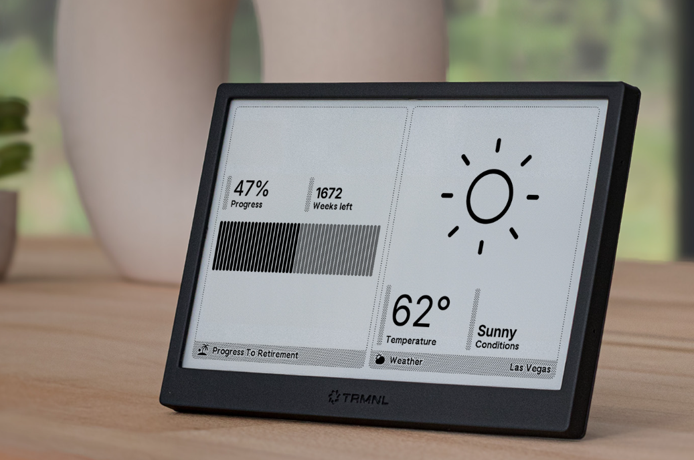

# Slipway for TRMNL Devices

## What is TRMNL?

TRMNL sell reasonably priced eInk devices which can display almost anything you like.
Check out their website [here](https://usetrmnl.com/).

They are a refreshingly open company:

 - You can connect TRMNL devices to either their servers or your own server (what they call [Bring-Your-Own-Server](https://docs.usetrmnl.com/go/diy/byos)).
 - You can either use the devices they sell, or make your own (what they call [Bring-Your-Own-Device](https://docs.usetrmnl.com/go/diy/byod)).
 - If you make your own device, you can use the same [open-source firmware](https://github.com/usetrmnl/firmware)
 that they run on official TRMNL devices.

The TRMNL devices are great, as is their web service which makes it simple to display a great range of plugins on your devices, or write your own.

## What is Slipway?

Slipway is a system for creating and hosting custom dashboards (that we call Rigs) on everything from simple eInk devices
(like TRMNL devices) to phones, tablets, watches, or even mission-control style arrays of screens.
Basically anything that can display either an image or a web page can display a Slipway Rig.

If you have data in one place and want to display it in another place, Slipway is designed to do that with minimum fuss and
minimum code. Our [landing page](/) is a good place to get more of an overview of Slipway.

## Why use Slipway with TRMNL devices?

When you run Slipway as a server, in addition to its normal endpoints it exposes a TRMNL compatible API.
This means that using Slipway with any TRMNL-compatible device is as simple as pointing the device at your Slipway server
during the initial device setup.

Here are some reasons why you might want to do this:

### Simplicity

Slipway is designed to be extremely simple to run and cheap to host:
- It ships as a single binary and uses only static configuration files on disk to run.
- All the configuration files are read-only when deployed, which means there is no live data to back up.
- There are no databases, message queues, persistent storage, or anything else to manage.
- All you need is cheap server, or you can quickly deploy it in a single container to a
service like [Fly.io](https://fly.io/) (and it will [probably be free](/docs/guides/hosting-on-fly)).

### Up-to-the-second information

The official TRMNL service generates screens in the background
at intervals, and when the TRMNL device requests a screen from the server it is directed to the last generated screen.

This means the screen may have been generated some time ago and contain stale information. Having
separate intervals for when the TRMNL device requests a screen, and when those screens are actually 
generated, adds complexity.

Slipway takes a different approach.
It generates screens on-demand every time the device requests it, so the information is always up to date.
It lets you specify refresh rates down to seconds (so if you want a clock, you can make a clock) and it
lets you specify precisely when the screen should refresh (for example _"on the hour, every hour"_).

This makes it easy to know when the current screen was generated, and when the next refresh will occur.

### Share Rigs and Components

Slipway Rigs are made up of Components, which are rigged together so that data flows through them.

You can share entire Rigs, so that others can reproduce your dashboards with their own data,
but you can also share any individual Components that you make.

Components can be self contained, for example a Component that fetches weather data and renders it beautifully
can be shared for other people to incorporate in their own Rigs.

Components can also be designed to be used by other Components.
For example you might share a Component that handles fetching calendar data from various sources,
but simply returns the data as JSON in a standard format.
This would allow others to use your Component as the data source for their own calendar Components,
which can then render the data appropriately for their particular device and use case.

### Flexibility

Components can be written in Javascript or any language that compiles to WASM.
Languages have different strengths and weaknesses, as do their ecosystems.
With Slipway you can mix and match.

Slipway supports multiple renderers, and new renderers can easily be written as Components by anyone.
Slipway provides Components for rendering
[Adaptive Cards](https://adaptivecards.io/samples/FlightUpdateTable.html),
[JSX files](https://og-playground.vercel.app/), SVG
and [ECharts](https://echarts.apache.org/examples/en/index.html) out of the box,
and all of these are open source in our [GitHub organization](https://github.com/slipwayhq/).

Our ecosystem is small at the moment, but I'm hoping that with an enthusiastic community it can expand rapidly.
You can see a [list of current components here](/components).

### Security

Slipway's [zero-trust security model](/docs/basics/permissions) is designed to let you safely execute Rigs and Components 
written by others on your own infrastructure.

You can give individual components access to files, environment variables, fonts or HTTP requests when necessary
using fine grained permissions, but everything is blocked by default.

## Getting Started

If this sounds appealing, check out our [documentation](/docs/intro) to for more information, or check out
our [landing page](/) for a more general overview!

