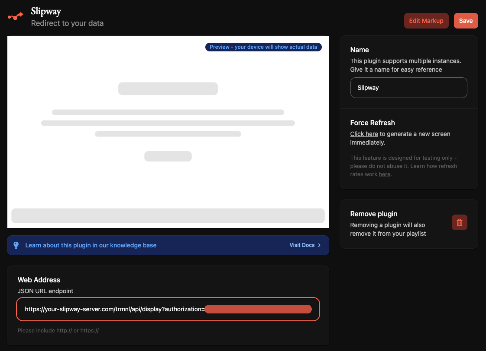

# TRMNL Quick Start

Using Slipway as a server for your TRMNL device is quick and easy.

:::info[TRMNL Quick Start Prerequisites]

These instructions assume you've already got a Slipway Server running, and have at least one
Rig and Playlist configured.

If you haven't done this, you can complete our 
[Slipway Quick Start](/docs/getting-started/create-your-first-rig)
in just a few minutes. 

Next, in your Rig file, make sure your canvas width and height matches your TRMNL device
(there are [better, more dynamic ways](/docs/basics/serving-rigs#device-context) to do this, but for now this is sufficient).

You should now be ready to proceed with the TRMNL Quick Start below.
:::

## Start your server and watch the logs

Ensure your server is running (you can run it locally with `slipway serve .`) and that you can see the logs.
If you're running locally, the logs will be output to your terminal window.
If you've deployed the server to [Fly.io](/docs/guides/hosting-on-fly) you can watch the logs by running `fly logs`.

:::tip
You will need to be able to see the logs when you add the TRMNL device.
:::

## Connecting your TRMNL device

There are two recommended ways you can get your TRMNL device talking to your Slipway server:

 - Connecting directly to your Slipway server.
 - Connecting via the [TRMNL Redirect plugin](https://help.usetrmnl.com/en/articles/11035846-redirect-plugin).

We'll briefly explain both of these options, and the advantages of each.

### Connecting directly to your Slipway server

The advantages of this method are:

 - Simplicity: Without the TRMNL infrastructure in the loop, there are fewer things that can go wrong.
 - Privacy: TRMNL's own servers are not involved at all.
 - Flexibility: You can run your Slipway server on the same local network as your devices, without the server
 needing to be accessible from the internet.

When you first set up your TRMNL device you're prompted for your WiFi SSID and password,
and in addition you can optionally enter an API Server URL.

The server URL should be the URL of your Slipway server __with `/trmnl` appended to the end__.

:::info[Example]
If your normal Slipway server URL is:
```
https://myslipwayserver.com/
```

Then you should point your TRMNL device at:
```
https://myslipwayserver.com/trmnl
```
:::

### Connecting via the TRMNL Redirect plugin

Your Slipway server needs to be publicly accessible on the internet for this method.
If you need to quickly get it hosted, you can probably [do it on Fly.io for free](/docs/guides/hosting-on-fly).

The advantages of this method are:

 - Firmware Updates: Because you're connecting via TRMNL's infrastructure, they can send your device
 firmware updates as new versions are released.
 - Management: You can still manage aspects of your device through TRMNL's website, for example monitoring its battery life.
 - Plugin ecosystem: By configuring TRMNL playlists can have your device displaying native TRMNL plugins sometimes, and Slipway plugins
 at other times, giving you access to both ecosystems.

When you set up your TRMNL device, let it connect to the default TRMNL servers as normal.

On the TRMNL website, add the [Redirect plugin](https://help.usetrmnl.com/en/articles/11035846-redirect) to a playlist
on your device. If you want to proceed to the next step right away (adding your device to the Slipway server) then
make sure the plugin will be the active plugin right now.

To configure the Redirect plugin, put the address of the TRMNL `display` API endpoint in the "Web Address" field.
This will be the domain where your server is hosted, followed by `/trmnl/api/display`.

:::info[Example]
If your normal Slipway server URL is:
```
https://myslipwayserver.com/
```

Then you should point the Redirect plugin at:
```
https://myslipwayserver.com/trmnl/api/display
```
:::

The "Refresh rate" field can be left alone, because with the Redirect plugin the device will receive
the refresh rate from the Slipway server response.



## Adding your device to Slipway

Once you've connected your TRMNL device, it will do one of two things:

- If the device has already been given an API key, for example if you've previously connected
it to the official TRMNL servers, or if you're connecting via the TRMNL Redirect plugin,
then it will immediately try and fetch a screen from your Slipway server
using the `/trmnl/api/display` endpoint, passing in its existing API key.

- If the device doesn't have an API key, it will first request one from your Slipway server
using the `/trmnl/api/setup` endpoint. Slipway will generate a new API key for the device automatically.
The device will then attempt to fetch a screen from the `/trmnl/api/display` endpoint passing in the new
API key.

In either case, as you have not added the device to your Slipway server configuration 
you will see a message similar to the following in the Slipway logs:

```
To allow this device, run the following command from your Slipway serve root:

    slipway serve . add-trmnl-device \
        --name "<NAME>" \
        --hashed-id "some_long_random_hash" \
        --hashed-api-key "some_long_random_hash" \
        --playlist <PLAYLIST>

Then re-deploy the server if necessary.
```

You should now run the command specified in your server logs (which will be similar to the one above, except it will include
the correct hashes for your device), replacing `<NAME>` with the name you'd like to give your device,
and replacing `<PLAYLIST>` with the name of the Slipway playlist you'd like the device to use.

:::info
Both the device name and the playlist name should be made up of only
lowercase alphanumeric characters and underscores, `so_something_like_this`.

If you followed the [Quick Start](/docs/getting-started/create-your-first-rig), the playlist name will be `every_so_often`.
:::

Running this command will automatically make the necessary configuration file changes to your server so that it recognizes
your TRMNL device.

After adding the device you'll need to restart the server (if running locally) or redeploy the server
(if it is hosted, for example by running `fly deploy` if you're using [Fly.io](/docs/guides/hosting-on-fly)).

:::info[Why do we have to manually add the device?]
The Slipway server never modifies its own configuration files, so you must always make any changes
you want yourself.
Although this process might seem a bit manual, it has some big advantages.

- Because you know the live server never changes, you don't need to worry about backing it up:
Your local copy of the configuration files always represents the latest state.

- Because we only store the [hashed versions of API keys](/docs/guides/secrests-and-hashed-api-keys)
in the configuration files, they are safe to upload to version control systems such as GitHub.

By storing your configuration files in a version control system you can easily track how your server
changes over time, and roll back to a previous configuration if necessary.

If your live server ever dies you can quickly re-deploy from your local configuration files with no data loss.
If you ever want to move hosts, just tear down the current server and deploy a new one.
:::

Once that is done you should be able to press the button on the back of your TRMNL device to
manually trigger a refresh, watch the page being generated in your Slipway logs, and finally see the screen
appear on your TRMNL device.

:::tip
As an extra step, when using Slipway with TRMNL devices it is recommended to also add a 
[`SLIPWAY_SECRET` Environment Variable](/docs/guides/the-slipway-secret-env) to improve security.
:::

## What Next?

That is all that is required to connect a TRMNL device to Slipway.
Next you might want to read through the [Basics section](/docs/category/basics) to understand how
to create new Components, Rigs and Playlists to display useful information on your device.