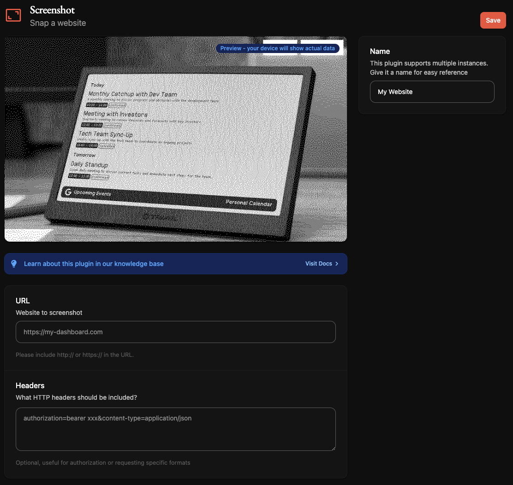
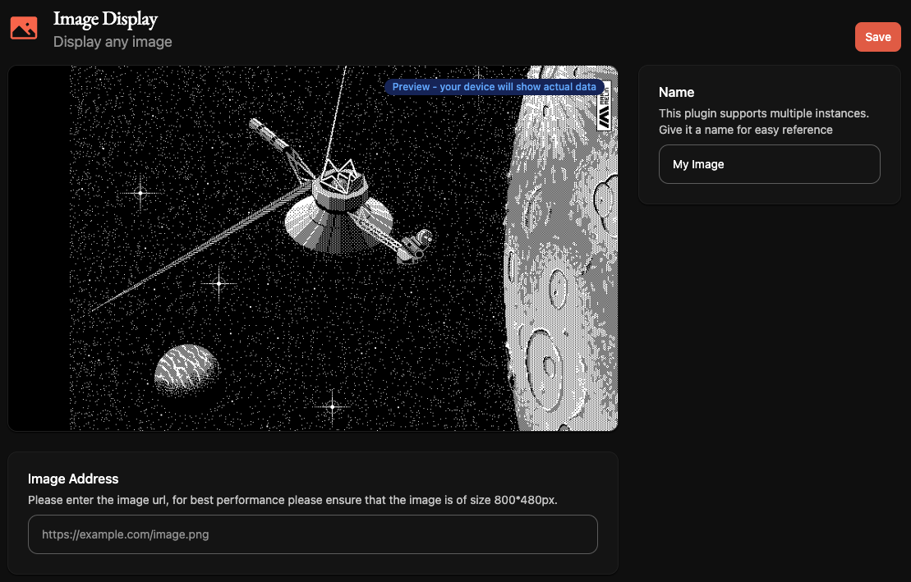

# Using Slipway through the TRMNL Website

The recommended way to use Slipway with a TRMNL device is to
[point the TRMNL device directly at your Slipway server](/docs/using-with-trmnl/trmnl-quick-start).

It's also technically possible to use Slipway alongside the other official TRMNL plugins by using either their 
[Screenshot Plugin](https://usetrmnl.com/integrations/screenshot) or their 
[Image Display Plugin](https://usetrmnl.com/integrations/image-display), and pointing those at your TRMNL server.

There are some downsides to this, primarily that screens will be generated in the background at intervals
which are hard to control precisely, and not when your device fetches them.

I've also had reliability issues, presumably caused by the TRMNL service not waiting long enough for Slipway
to generate a screen, although it's hard to say.

When I tried configuring the plugins below while writing this document I didn't actually have any success at all,
although I have in the past.

However, if you want to give it a go, here is how you would set it up.

Let's say you have Slipway running at `https://my-slipway-server.fly.dev` and you have a Rig called
`my_rig`, a playlist called `my_playlist` or a device called `my_device`.

## Screenshot Plugin



You should set the `URL` field to the URL of your Rig, Playlist or Device (depending on what you want to display),
for example:
```
https://my-slipway-server.fly.dev/rigs/my_rig?format=html
```
or
```
https://my-slipway-server.fly.dev/devices/my_device?format=html
```

We've set the [`format` query string parameter](/docs/basics/serving-rigs#format) to `html` so that Slipway will return an HTML page containing a single image,
which is the screen we want to display. You could also try using `format=html_embed` which uses an embedded image (via a `data://` URL).

Next, set the `Headers` field to:
```
authorization=<YOUR_API_KEY>
```

Where `<YOUR_API_KEY>` is one of the __unhashed__ API keys you've added to your `slipway_serve.json` file.

With these settings configured you should be able to Force Refresh the plugin and view your rig.
It can be helpful to watch your Slipway logs while this happens (using `fly logs` if you're using Fly.io),
to help diagnose any issues you might have.

## Image Display Plugin



I don't recommend using the Image Display plugin because it doesn't allow you to specify headers,
forcing you to enter the API key as a query string parameter.

Having said that, you should be able to configure it in a similar way to the Screenshot Plugin.

Set the URL to something like:
```
https://my-slipway-server.fly.dev/rigs/my_rig?format=image&authorization=<YOUR_API_KEY>
```

Note that here we've set the [`format` query string parameter](/docs/basics/serving-rigs#format) to `image`, so that an image is returned (it will default to a PNG, although you can [change this](/docs/basics/serving-rigs#image_format)). 

Also note we've put the API key as the `authorization` query string parameter.
Ensure your API key is URL encoded if necessary.

Perhaps in future TRMNL will release a version of the Image Display plugin that
allows you to specify headers, so we could put the authorization as a header.

