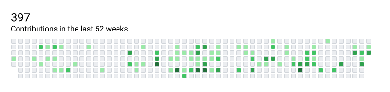
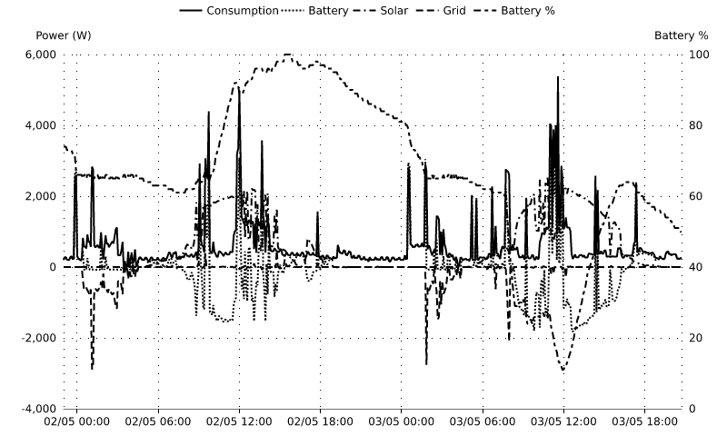
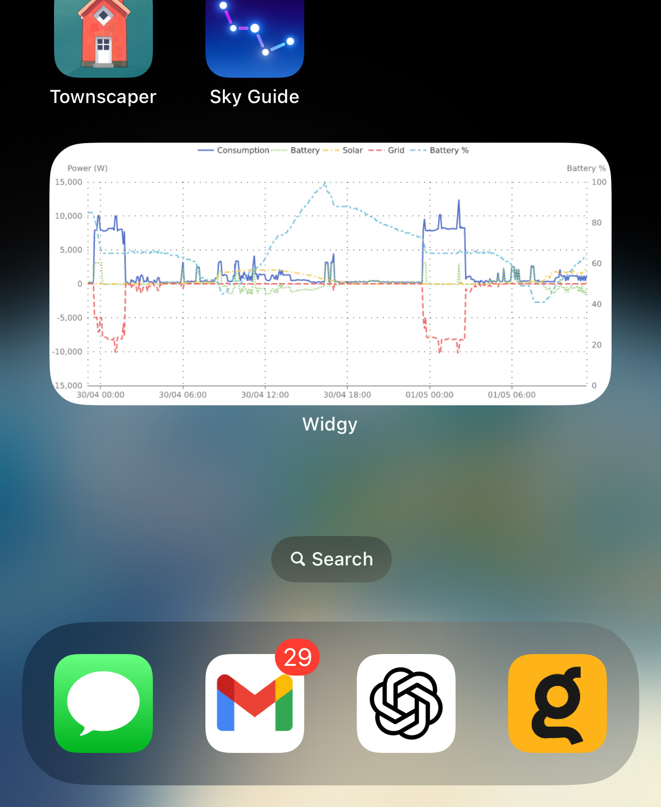

If you've created components of your own, that others might like to use, [let me know](/community) and I can
feature the best ones here. 

# Canvas Components

A "Canvas Component" is what we call a Component which takes some configuration data and outputs a rendered canvas, ready to drop
in to your Rigs.

## [`jamesthurley.github_commit_graph`](https://github.com/jamesthurley/slipway_github_commit_graph)

A themeable Component which renders the GitHub commit graph for the given username.

Rendered with the default theme:

Rendered with a custom theme as an Apple Watch widget:

## [`jamesthurley.givenergy_cloud`](https://github.com/jamesthurley/slipway_givenergy_cloud)

Reads solar, battery and power usage information for [GivEnergy](https://givenergy.co.uk/) house batteries and inverters,
and displays them in a handy chart. Supports color, or monochrome for eInk displays.

Rendered for a TRMNL eInk screen:

Rendered in color as an iPhone widget:

# Renderer Components

Renderers take structured data and output a rendered canvas.

## [`slipwayhq.render`](https://github.com/slipwayhq/slipway_render)

This renderer uses [Adaptive Cards](https://adaptivecards.io/) JSON to layout elements on the dashboard, and can call out
to other renderers to embed charts, SVGs, or anything else.

## [`slipwayhq.jsx`](https://github.com/slipwayhq/slipway_jsx)

Renders [JSX markup](https://og-playground.vercel.app/) to an image.

## [`slipwayhq.svg`](https://github.com/slipwayhq/slipway_svg)

Renders [SVG markup](https://developer.mozilla.org/en-US/docs/Web/SVG) to an image.

## [`slipwayhq.echarts`](https://github.com/slipwayhq/slipway_echarts)

Renders [echarts](https://echarts.apache.org/examples/en/index.html) definitions to an image.

# Other Components

## [`slipwayhq.fetch`](https://github.com/slipwayhq/slipway_fetch)

Fetches and outputs the requested URLs, files, or anything else supported by the Host API fetch methods.
Useful for loading files to provide as an input to other Components.

## [`slipwayhq.modify`](https://github.com/slipwayhq/slipway_modify)

Uses a simple syntax to make changes to JSON. Useful for manipulating the output of one Component before
passing it in to another Component.
