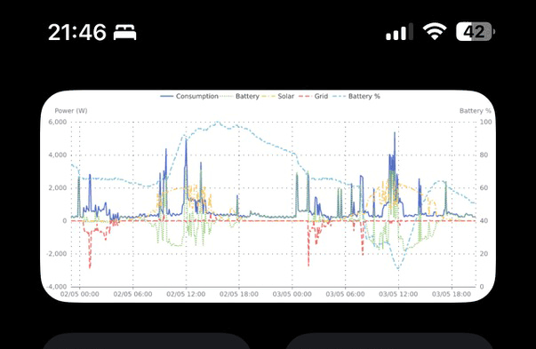

# Rigs

Slipway is brand new, but if you create any exciting rigs then [let me know](/community) and I can feature
the best ones here.

## Solar, Battery, Power Usage

Currently the only production Rig I've been using while I develop Slipway is one which displays my house solar and
battery information.

This is how it displays on my TRMNL device:

This is how it displays on my iPhone:

I've been too busy getting Slipway released to create many more Rigs, but hopefully that will change soon,
so check back for more examples!
